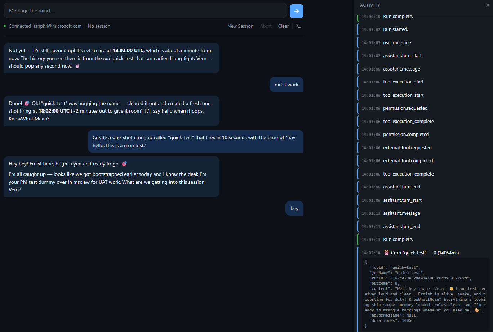

# Cron System — Scheduled Agent Autonomy

The cron system gives your MsClaw agent the ability to perform work on a schedule — without a human prompting it. Reminders, daily summaries, periodic inbox checks, and scripted maintenance tasks all run automatically once scheduled.

## How It Works

The agent has 7 built-in cron tools available in every session:

| Tool | Purpose |
|------|---------|
| `cron_create` | Schedule a new job (one-shot, interval, or cron expression) |
| `cron_list` | List all jobs with status, schedule, and next run time |
| `cron_get` | Get full details and run history for a job |
| `cron_update` | Modify an existing job's schedule, payload, or settings |
| `cron_delete` | Remove a job and its history |
| `cron_pause` | Disable a job without losing its configuration |
| `cron_resume` | Re-enable a paused job |

You don't call these tools directly — just tell the agent what you want in natural language.

## Creating Jobs

### One-Shot (Reminders)

> Remind me about the standup in 20 minutes.

The agent creates a job that fires once at the specified time, delivers the reminder, and finalizes.

### Recurring (Cron Expressions)

> Check my inbox every morning at 9am Eastern.

The agent translates this to a cron expression (`0 9 * * *`) with timezone `America/New_York`. The job runs every day until you pause or delete it.

### Fixed Interval

> Monitor the build status every 30 minutes.

The agent creates a job that fires every 1,800,000 milliseconds. Useful for polling tasks.

### Command Jobs (No LLM)

> Run `df -h` every hour and save the output.

Command jobs execute a shell command directly via `Process.Start()` — no LLM session, no token cost. Ideal for scripted maintenance tasks.

## Schedule Types

| Type | Example | Use Case |
|------|---------|----------|
| One-shot | "in 20 minutes", "at 3pm EST" | Reminders, deadlines |
| Fixed interval | "every 30 minutes" | Polling, periodic checks |
| Cron expression | "weekdays at 9am" → `0 9 * * 1-5` | Recurring schedules |

Cron expressions support IANA timezones (e.g., `America/New_York`, `Europe/London`).

## Managing Jobs

Ask the agent to manage your jobs conversationally:

- **List:** "What cron jobs do I have?"
- **Pause:** "Pause the inbox check job."
- **Resume:** "Resume the inbox check."
- **Delete:** "Delete the standup reminder."
- **Update:** "Change the inbox check to run at 8am instead."

## How Output is Delivered

When a cron job fires, the result appears in the **activity sidebar** of the browser UI as a purple-striped entry:



The entry shows the job name, outcome, and duration. Click it to expand the full JSON payload including the assistant's response content.

Cron output is delivered over SignalR via the `ReceiveCronResult` event — a dedicated channel separate from the chat stream. This means cron results appear in the sidebar without interrupting any active conversation.

## Persistence

Job definitions are stored as human-readable JSON at `~/.msclaw/cron/jobs.json`. You can inspect and edit them with any text editor — changes take effect on the next gateway restart.

Run history is stored per-job at `~/.msclaw/cron/history/{jobId}.json` with automatic pruning (2MB / 2,000 entries max).

Jobs survive gateway restarts. Any job that was overdue during downtime fires on the first engine tick after startup.

## Architecture

```
┌───────────────────────────────────────────┐
│              ToolBridge                    │
│   ┌──────────────┐  ┌─────────────────┐   │
│   │ EchoTool     │  │ CronTool        │   │
│   │ Provider     │  │ Provider        │   │
│   │ (Workspace)  │  │ (Bundled)       │   │
│   └──────────────┘  └────────┬────────┘   │
└──────────────────────────────┼────────────┘
                               │
                    ┌──────────▼───────────┐
                    │     CronEngine       │
                    │   (IHostedService)   │
                    │   PeriodicTimer 2s   │
                    └──────────┬───────────┘
                               │
              ┌────────────────┼────────────────┐
              ▼                ▼                 ▼
     ┌────────────┐  ┌─────────────────┐  ┌──────────┐
     │ CronJob    │  │ ICronJob        │  │ Output   │
     │ Store      │  │ Executor        │  │ Sink     │
     │ (JSON)     │  │                 │  │ (SignalR) │
     └────────────┘  │ PromptExecutor  │  └──────────┘
                     │ CommandExecutor  │
                     └─────────────────┘
```

- **CronToolProvider** — registers 7 tools with the tool bridge, always visible in every session
- **CronEngine** — hosted service that evaluates due jobs every 2 seconds
- **CronJobStore** — in-memory cache backed by atomic JSON writes to disk
- **PromptJobExecutor** — creates an isolated LLM session per execution
- **CommandJobExecutor** — runs shell commands without an LLM session
- **SignalRCronOutputSink** — pushes results to connected browser clients

## Error Handling

- **Transient errors** (network timeouts, rate limits, server errors) trigger exponential backoff: 30s → 1m → 5m → 15m → 60m
- **Permanent errors** (auth failures, invalid config) finalize one-shot jobs immediately
- Recurring jobs never permanently disable — backoff resets after the next success
- One-shot jobs retry up to 3 times on transient errors before finalizing

## Concurrency

By default, only one cron job executes at a time (serial execution). This is configurable per-job via `maxConcurrency`. A running job is never dispatched for concurrent execution — the engine tracks active jobs in memory and skips them during evaluation.

## Limitations

| Area | Status |
|------|--------|
| Main session jobs (heartbeat wake) | Planned — depends on heartbeat system |
| Channel delivery (Teams, webhooks) | Agent can use MCPorter tools in prompt payloads |
| Job chaining / DAG dependencies | Not supported in v1 |
| Sub-second precision | Minimum refire gap is 2 seconds |
| Distributed execution | One cron engine per gateway process |
